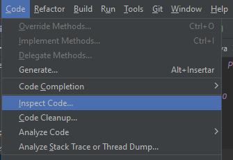
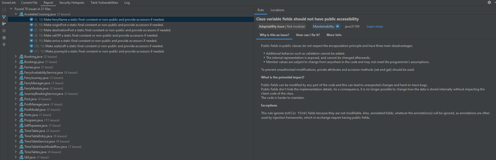

# Análisis Estático del Proyecto Sistema de Reserva de Ferry

## Uso del Análisis dado por IntelliJ

### Análisis de Código
1. Ingresamos a la opción de Code > Inspect Code.

2. Seleccionamos la opción de Whole Project y damos clic en Ok.

3. Se muestra el resultado del análisis de código y decidimos ver los resultados según su severidad y tipo de problema

4. Como podemos ver, primero vemos los más grandes. En la parte izquierda se detallan los problemas encontrados y en la parte derecha se muestra el código con el problema.
Además, en algunos casos se muestra una solución propuesta y también hay links para obtener más información acerca del problema.

5. Luego vemos el próximo grado de severidad, el medio. Donde se repite el mismo proceso.

6. Finalmente, vemos los problemas de severidad menor. Que se basan más que todo en la forma y la gramática del código.

7. En general, el análisis de código nos permite ver los problemas que tiene nuestro código y nos da una idea de cómo podemos mejorarlos.
El siguiente paso consistirá entonces en corregir los errores encontrados y volver a realizar el análisis de código para ver si se han corregido los problemas.

---
## Uso del Análisis dado por SonarLint (Un plugin en IntelliJ)
1. Agregamos el plugin de SonarLint a IntelliJ.

2. Ingresamos a SonarLint > Report > Analyze All Files.

    

3. Se muestra un listado de problemas según las clases en las que están. Como podemos ver a continuación, se muestra el problema en la parte izquierda
y en la parte derecha hay tres pestañas. En la primera, se muestra la explicación del problema, una posible causa o naturaleza del problema (si es por adaptabilidad, consistencia, intencional, etc),
la clase de problema (si es de Mantenibilidad, Seguridad, etc.), el potencial impacto y las excepciones al problema.
   

   En segunda pestaña, se muestra cómo se puede arreglar.
   

   Y finalmente, en la tercera pestaña hay un link para obtener más información acerca del problema.
   

---
## Uso del Análisis dado por SonarCloud

---
## Uso del Análisis dado por Snyk