# Análisis Estático del Proyecto Sistema de Reserva de Ferry

## Uso del Análisis dado por IntelliJ

### Análisis de Código

1. Ingresamos a la opción de Code > Inspect Code.

2. Seleccionamos la opción de Whole Project y damos clic en Ok.
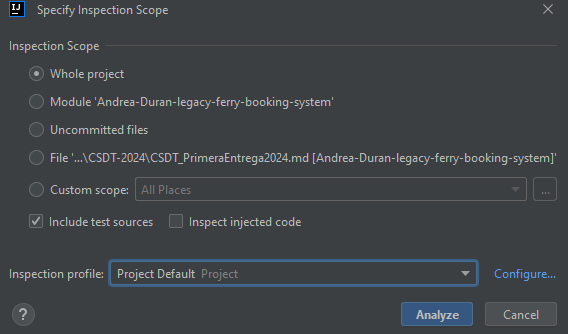

3. Se muestra el resultado del análisis de código y decidimos ver los resultados según su severidad y tipo de problema
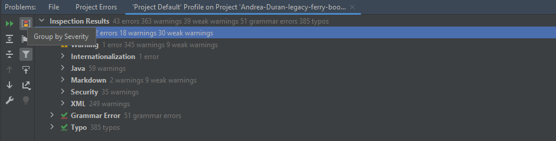

4. Como podemos ver, primero vemos los más grandes. En la parte izquierda se detallan los problemas encontrados y en la parte derecha se muestra el código con el problema.
Además, en algunos casos se muestra una solución propuesta y también hay links para obtener más información acerca del problema.
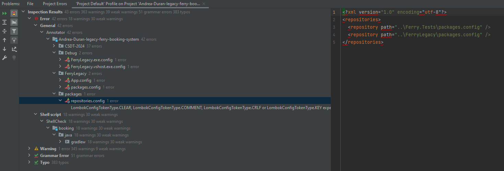

5. Luego vemos el próximo grado de severidad, el medio. Donde se repite el mismo proceso.
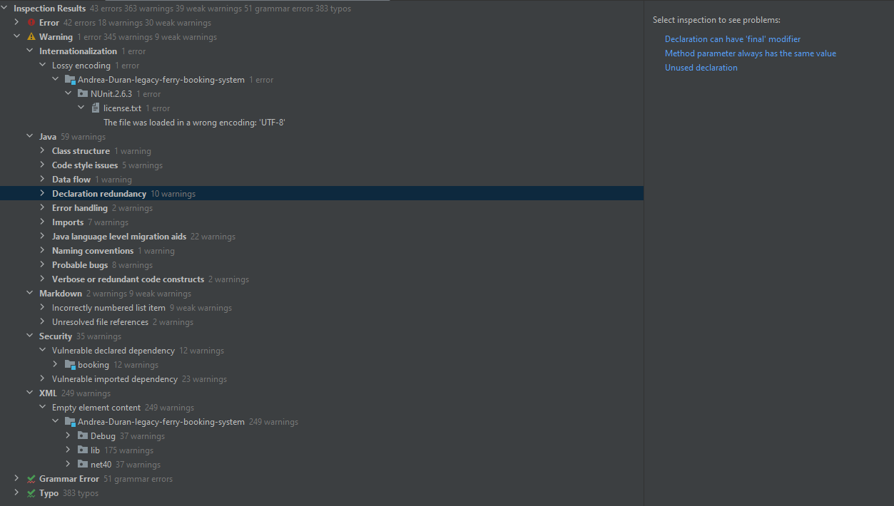

6. Finalmente, vemos los problemas de severidad menor. Que se basan más que todo en la forma y la gramática del código.
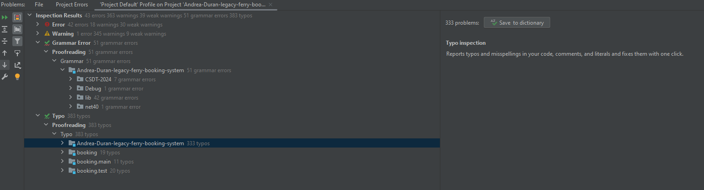

7. En general, el análisis de código nos permite ver los problemas que tiene nuestro código y nos da una idea de cómo podemos mejorarlos.
El siguiente paso consistirá entonces en corregir los errores encontrados y volver a realizar el análisis de código para ver si se han corregido los problemas.

---
## Uso del Análisis dado por SonarLint (Un plugin en IntelliJ)

SonarLint es una extensión de IDE (Entorno de Desarrollo Integrado) que proporciona análisis de código en tiempo real mientras los desarrolladores escriben código. SonarLint está diseñado para ser ligero y rápido, permitiendo a los desarrolladores identificar y corregir problemas de calidad y seguridad en el código casi instantáneamente. SonarLint es compatible con una amplia gama de IDEs, incluyendo IntelliJ IDEA, Eclipse, Visual Studio, y Visual Studio Code. Al igual que SonarCloud, SonarLint se centra en la identificación de problemas de calidad y seguridad, pero a nivel local en el entorno de desarrollo del desarrollador.

### Análisis de Código

1. Agregamos el plugin de SonarLint a IntelliJ.
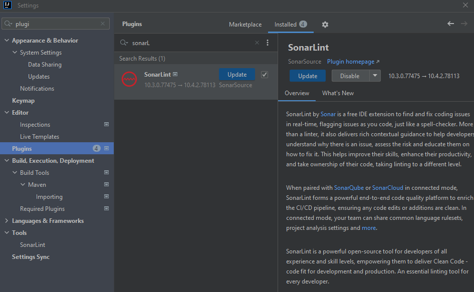

2. Ingresamos a SonarLint > Report > Analyze All Files.

    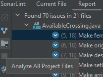

3. Se muestra un listado de problemas según las clases en las que están. Como podemos ver a continuación, se muestra el problema en la parte izquierda
y en la parte derecha hay tres pestañas. En la primera, se muestra la explicación del problema, una posible causa o naturaleza del problema (si es por adaptabilidad, consistencia, intencional, etc),
la clase de problema (si es de Mantenibilidad, Seguridad, etc.), el potencial impacto y las excepciones al problema.
   

   En segunda pestaña, se muestra cómo se puede arreglar.
   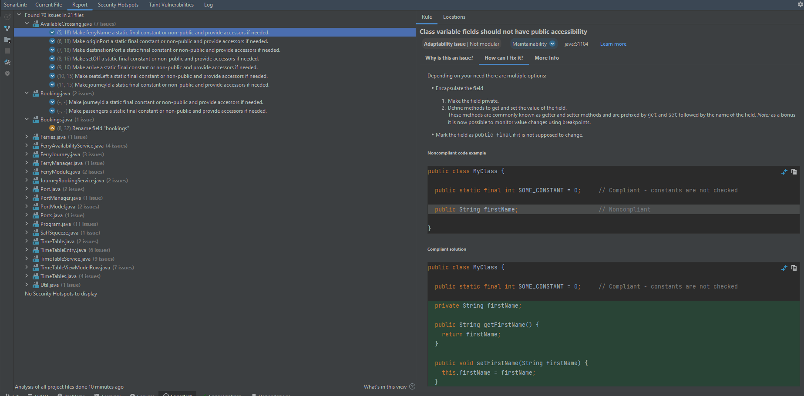

   Y finalmente, en la tercera pestaña hay un link para obtener más información acerca del problema.
   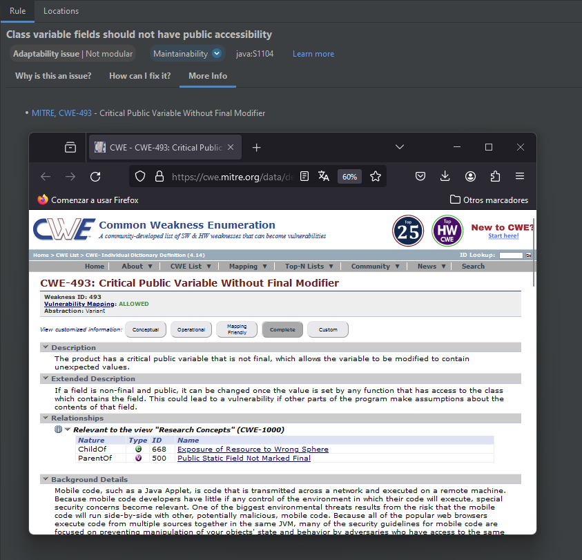

---
## Uso del Análisis dado por SonarCloud

SonarCloud es una plataforma de análisis de código estático que se utiliza para identificar problemas de calidad y seguridad en el código fuente. Es una extensión de SonarQube, una herramienta de análisis de código estático ampliamente utilizada para proyectos de software. SonarCloud se centra en el análisis de código en la nube, lo que permite a los equipos de desarrollo integrar fácilmente el análisis de código en sus flujos de trabajo de desarrollo continuo (CI/CD). Al alojar el análisis en la nube, SonarCloud puede analizar proyectos de cualquier tamaño y en cualquier lenguaje de programación, siempre que el proyecto esté alojado en un repositorio público o privado en GitHub, Bitbucket, GitLab, o Azure DevOps.

Por falta de permisos dentro de la organización, lo que se hizo fue subir el proyecto a un repositorio de GitHub en la cuenta personal y analizarlo desde ahí.

### Análisis de Código

---
## Uso del Análisis dado por Snyk

Snyk es una herramienta de seguridad para el desarrollo de software que ayuda a los equipos de desarrollo a identificar y corregir vulnerabilidades en sus dependencias de código abierto. Snyk se integra con los sistemas de integración continua/despliegue continuo (CI/CD) y proporciona análisis en tiempo real de las dependencias de un proyecto para detectar vulnerabilidades conocidas. Una vez identificadas, Snyk ofrece soluciones para actualizar o reemplazar las dependencias vulnerables, lo que ayuda a mejorar la seguridad del software y a reducir el riesgo de ataques de seguridad.

Snyk soporta una amplia gama de lenguajes de programación y gestores de paquetes, incluyendo JavaScript (npm, yarn), Python (pip), Ruby (bundler), Java (Maven, Gradle), .NET, y muchos otros. Además, Snyk ofrece una API para automatizar el proceso de análisis y actualización de dependencias, lo que facilita la integración con flujos de trabajo de desarrollo existentes.

Por falta de permisos dentro de la organización, lo que se hizo fue subir el proyecto a un repositorio de GitHub en la cuenta personal y analizarlo desde ahí.

### Análisis de Código

1. Agregamos el proyecto a Snyk.
   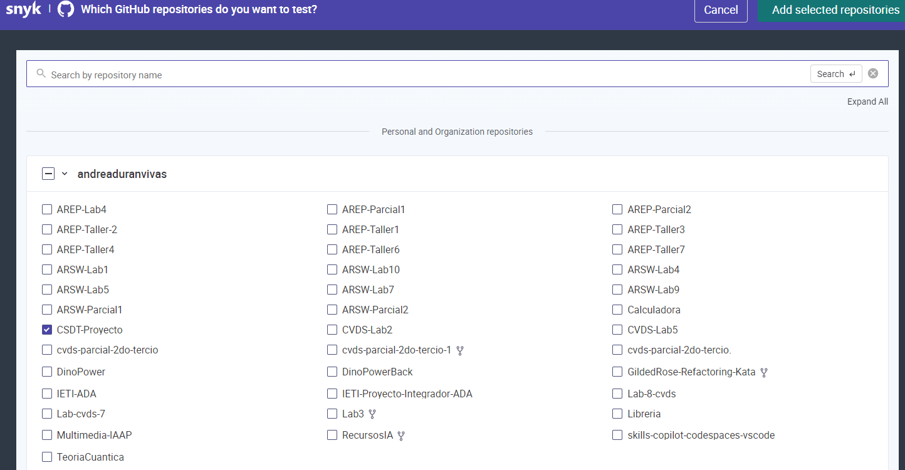

2. Vemos el análisis de vulnerabilidades hecho por Snyk.
   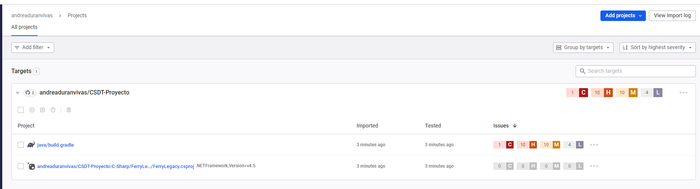

3. Miramos el detalle de la lista de vulnerabilidades encontradas organizadas según su severidad. La mayoría de los problemas están relacionados al
versionamiento de las dependencias como se ve en la imagen.
   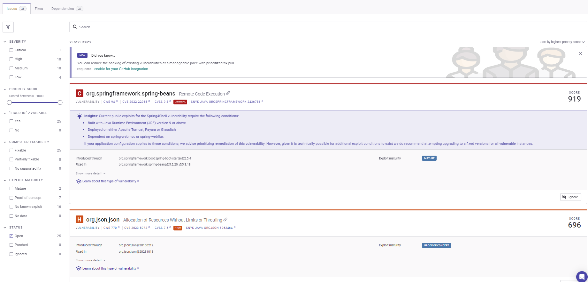

3. Verificamos toda la información de la vulnerabilidad, como la descripción, la posible solución y el impacto de la vulnerabilidad (Snyk califica las vulnerabilidades,
entre más alto sea el puntaje, es más grave. La razón de la calificación está en los links relacionados).

   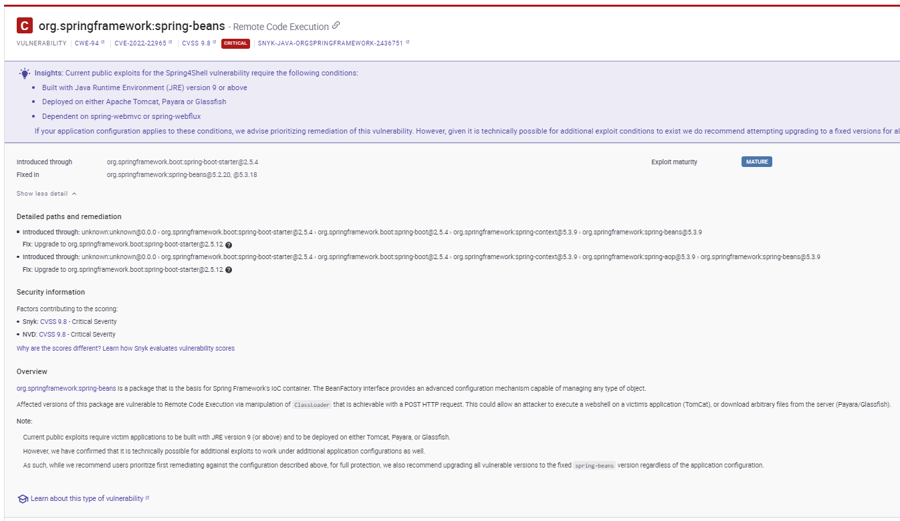