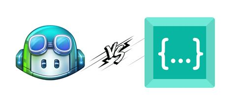
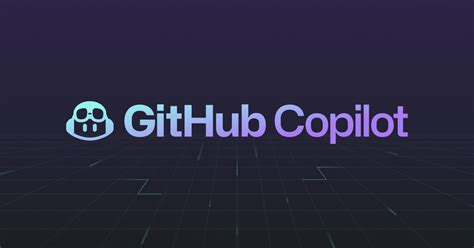
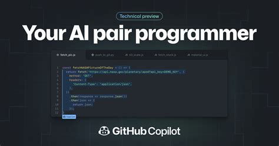
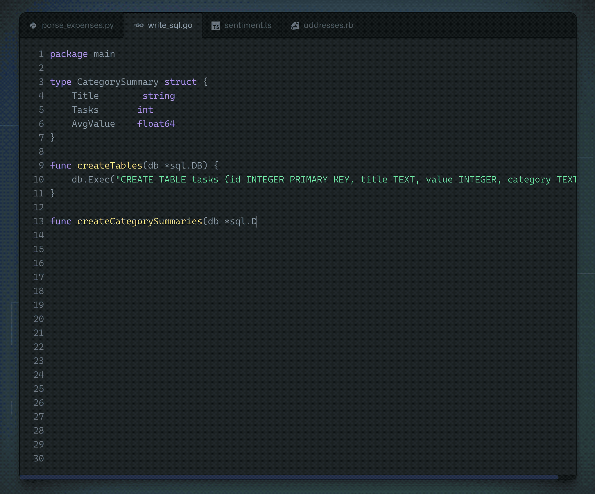
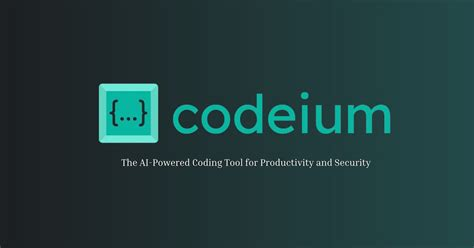
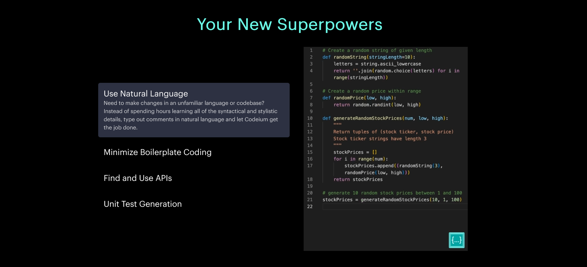
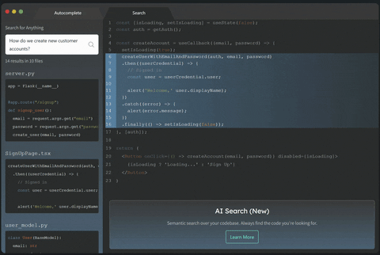

# Proyecto de Ferries: Análisis y Mejoras

## Resumen 📝

Este proyecto de ferries se centra en la gestión de reservas, disponibilidad de ferries, y la interacción entre puertos y 
ferries. A través de un análisis detallado, identificamos puntos fuertes y áreas de mejora, especialmente en relación con 
la experiencia del desarrollador (DevEx) y la productividad, así como oportunidades para mejorar.

## Puntos Positivos 😀👍

- **Modularidad**: El proyecto está bien estructurado en paquetes, facilitando la comprensión y el mantenimiento del código. Cada clase tiene una responsabilidad clara, lo que es una buena práctica de diseño de software.

- **Uso de JSON para la configuración**: La carga de datos de ferries y puertos desde archivos JSON permite una configuración flexible y fácil de cambiar sin necesidad de modificar el código fuente.

- **Abstracción de la lógica de negocio**: La separación de la lógica de negocio (como la disponibilidad de ferries y la gestión de reservas) de la lógica de acceso a datos y presentación mejora la mantenibilidad y escalabilidad del sistema.

## Puntos Negativos 😞👎

- **Manejo de excepciones:** El manejo de excepciones es mínimo y en algunos casos, simplemente se imprime la traza de la excepción. Esto puede dificultar la depuración y el manejo adecuado de errores en producción.

- **Falta de inyección de dependencias:** El código no muestra el uso de inyección de dependencias, lo que puede dificultar la prueba y la reutilización de componentes.

- **Uso de System.out.println para depuración:** En lugar de utilizar un sistema de logging, se utiliza System.out.println para depuración, lo que no es recomendable para aplicaciones en producción.

## Oportunidades de Mejora 🤔💡

- **Manejo de excepciones**: Implementar un manejo de excepciones más completo.

- **Inyección de dependencias**: Utilizar un framework de inyección de dependencias para mejorar la modularidad y facilitar las pruebas.

- **Sistema de logging**: Reemplazar `System.out.println` con un sistema de logging adecuado para mejorar la depuración y la gestión de errores.

- **Pruebas unitarias y de integración**: Añadir pruebas unitarias y de integración para asegurar la calidad del código y facilitar la detección temprana de errores.

## Métricas Identificables 📊🔍

- **Tiempo de respuesta de las funciones críticas:** Medir el tiempo que toman las funciones críticas, como la disponibilidad de ferries y la gestión de reservas, para identificar cuellos de botella.

- **Tasa de errores:** Monitorear la tasa de errores en el sistema para identificar y abordar problemas de calidad.

- **Tiempo de desarrollo:** Medir el tiempo que toma desarrollar nuevas funcionalidades o corregir errores para evaluar la eficiencia del proceso de desarrollo.

## Oportunidades de Mejora Relacionadas con SPACE 📈🚀

- **Satisfaction**: Mejorar la interfaz de usuario y la experiencia del usuario para aumentar la satisfacción.

- **Performance**: Optimizar el rendimiento de las funciones críticas para mejorar la eficiencia.

- **Efficiency**: Implementar prácticas de desarrollo más eficientes para aumentar la productividad. Por ejemplo, la automatización de pruebas.

## Oportunidades de Mejora Relacionadas con DevEx 👩‍💻🌈

- **Eficiencia**: Implementar herramientas y prácticas que aumenten la eficiencia del desarrollo.

- **Retención**: El código original podría ser difícil de mantener y entender, lo que puede llevar a la rotación del personal.

- **Calidad**: Mejorar la calidad del código y la documentación para facilitar el mantenimiento y la colaboración.

- **Productividad**: Implementar prácticas que aumenten la productividad del equipo de desarrollo.

- **Satisfacción**: Mejorar la arquitectura y la calidad del código para aumentar la satisfacción del equipo de desarrollo.

### Consideraciones Importantes 🌟💼

- **Feedback Loop:** Implementar un feedback loop para los desarrolladores, donde puedan proporcionar retroalimentación sobre su experiencia de desarrollo y recibir orientación para mejorar.

- **Cognitive Load:** Minimizar la carga cognitiva de los desarrolladores, proporcionando documentación clara y herramientas que faciliten la comprensión y el uso del código y las herramientas.

- **Flow State:** Fomentar un estado de flujo en el desarrollo, donde los desarrolladores se sientan comprometidos y productivos, a través de un entorno de trabajo que apoye la creatividad y la innovación.

---
## Herramientas AI 🤖

En el ámbito del desarrollo de software, las herramientas basadas en Inteligencia Artificial (IA) como GitHub Copilot, AWS CodeWhisperer y Codeium están revolucionando la forma en que los desarrolladores escriben y optimizan su código. Estas herramientas utilizan algoritmos de aprendizaje automático para analizar el código existente y proporcionar sugerencias de mejora, generar segmentos de código en tiempo real y facilitar la implementación de pruebas unitarias, refactorización y más. A continuación, exploraremos las características, beneficios y cómo estas herramientas pueden mejorar la productividad y la experiencia del desarrollador.

### GitHub Copilot

#### Características

- **Autocompletado de código**: GitHub Copilot proporciona sugerencias de código basadas en el contexto del código que se está escribiendo.
- **Generación de código**: Ayuda a generar segmentos de código completos, incluso funciones enteras, basándose en el código proporcionado.
- **Soporte multilenguaje**: Compatible con una amplia gama de lenguajes de programación.
- **Integración con IDEs**: Disponible en varios editores de código y IDEs, incluyendo Visual Studio Code.

#### Beneficios

- **Aumento de la productividad**: Reduce el tiempo necesario para escribir código, permitiendo a los desarrolladores centrarse en la lógica de negocio.
- **Mejora de la calidad del código**: Al proporcionar sugerencias basadas en grandes conjuntos de datos de código público, Copilot puede ayudar a evitar errores comunes y promover mejores prácticas de codificación.
- **Aprendizaje y crecimiento**: Los desarrolladores pueden aprender nuevos patrones de codificación y mejores prácticas a través de las sugerencias proporcionadas por Copilot.

### Codeium

#### Características

- **Autocompletado de código**: Proporciona sugerencias inteligentes de código.
- **Corrección de código y documentación**: Mejora la calidad y mantenibilidad del código.
- **Búsqueda en lenguaje natural**: Facilita la búsqueda de fragmentos de código y documentación.
- **Asistente de programación**: Mejora la productividad, permitiendo a los desarrolladores centrarse en la lógica de codificación.

#### Beneficios

- **Eficiencia en el proceso de codificación**: Streamlinea el proceso de codificación, haciéndolo más eficiente y libre de errores.
- **Ahorro de tiempo y esfuerzo**: Reduce el tiempo y esfuerzo necesarios para completar tareas de codificación.
- **Mejora de la calidad del código**: Ayuda a escribir código limpio y optimizado.

